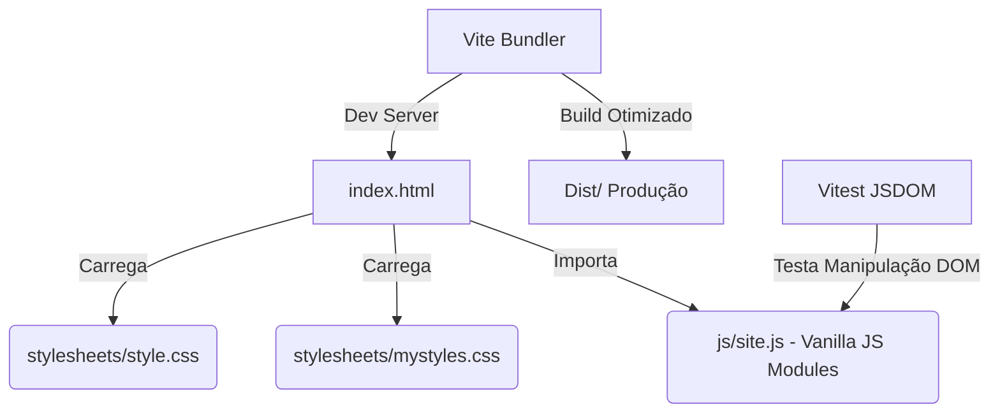

# AWS Community Day Brasil 2021 🚀


## 📌 Overview
O **AWS Community Day Brasil 2021** é um repositório voltado para a landing page do evento comunitário oficial. Originalmente construído com bibliotecas obsoletas como jQuery e Bootstrap 3, este projeto foi inteiramente modernizado para garantir alta performance, legibilidade e manutenibilidade.

As principais inovações técnicas incluem a adoção de **Vanilla JS (ES6+)** e **Vanilla CSS**, eliminando o acoplamento excessivo e a dívida técnica herdada de frameworks legados. A estrutura foi reescrita seguindo as melhores práticas de Engenharia de Software voltadas para um ambiente didático e coeso, sendo suportado por um ecossistema moderno baseado no bundler **Vite** e contando com suíte de testes unitários através do **Vitest**.

## 🏗 Arquitetura do Projeto

O fluxo de processamento e interação segue um modelo estático moderno, centralizado em um bundler rápido:



## ⚙️ Guia de Instalação e Execução

Siga as instruções abaixo para executar o projeto localmente:

1. **Pré-requisitos:** Certifique-se de ter o [Node.js](https://nodejs.org/) instalado.
2. **Instalação das dependências:**
   ```bash
   npm install
   ```
3. **Executando o Servidor de Desenvolvimento:**
   ```bash
   npm run dev
   ```
   > O Vite irá iniciar um servidor local (geralmente em `http://localhost:5173/`) com Hot Module Replacement (HMR).

4. **Executando os Testes (QA):**
   ```bash
   npm run test
   ```

5. **Gerando Build de Produção:**
   ```bash
   npm run build
   ```

## 🧠 Boas Práticas Adotadas (Didática)
- **Desacoplamento:** O comportamento JS foi totalmente separado em funções isoladas em `js/site.js` para manipulação de eventos (Clean Code).
- **Independência Visual:** CSS Grid e Flexbox nativos substituíram classes do Bootstrap, promovendo maior controle e leveza.
- **Internacionalização no Código:** Nomenclatura de métodos e variáveis mantidas no inglês internacional (ex: `initializeNavigation()`), enquanto os comentários didáticos e documentação estão em português brasileiro.
